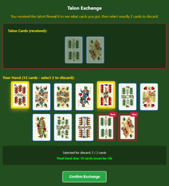
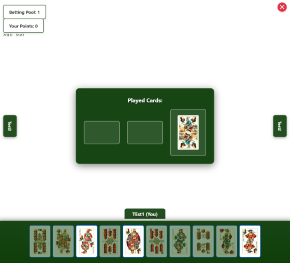

# ULTI

This project is a full-stack implementation of an online version of the Hungarian card game Ulti.  
The application allows players to play with each other through a web interface.

The goal of the project was to design and implement a complete web-based card game system, including both the frontend user interface and the backend game logic.

## Features

- Interactive card game interface
- Card selection and exchange mechanics
- Real-time gameplay interactions
- Visualization of player hands and played cards

## Technologies Used

- **Backend:** Go
- **Frontend:** Vue.js
- **Database:** PostgreSQL
- **Containerization:** Docker

## Preview

Below are example screenshots from the application showing different phases of the game interface.

| Talon Exchange                          | During the game                         |
| --------------------------------------- | --------------------------------------- |
|  |  |
