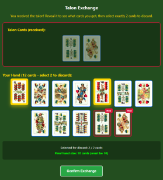
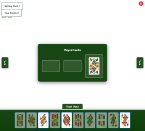

# Ulti – Online Multiplayer Card Game

A full-stack online multiplayer card game based on a simplified version of **Ulti**, a traditional Hungarian card game.

The application was built with a **Go backend**, **Vue.js frontend**, relational database support, real-time communication, and Docker-based deployment.

## What is Ulti?

Ulti is a traditional three-player Hungarian card game.

In this implementation, players go through multiple phases including bidding, talon exchange, and turn-based card play. One player becomes the declarer and plays against the other two players.

## Technologies

**Backend:** Go, REST APIs, WebSockets, JWT  
**Frontend:** Vue.js, Vue Router, Vite, JavaScript, HTML, CSS  
**Database:** PostgreSQL, MySQL  
**Infrastructure:** Docker, Docker Compose, Nginx

## Features

- Three-player online multiplayer gameplay
- User registration and authentication
- Player profiles and game history
- Bidding phase
- Talon card exchange
- Turn-based card gameplay
- Real-time game updates using WebSockets
- Automatic game state and result handling
- Persistent database storage
- PostgreSQL and MySQL support

## Frontend

The frontend is a Vue.js Single-Page Application built with Vite.

It handles:

- User authentication views
- Game navigation
- Player profiles and settings
- Card and hand visualization
- Bidding
- Talon exchange
- Gameplay interactions
- Game results

## Backend

The backend is written in Go and is responsible for:

- REST API endpoints
- Authentication
- Multiplayer game sessions
- Game logic and state management
- WebSocket communication
- Database operations
- Player and game history management

## Gameplay Preview

### Talon Exchange

The declarer can inspect the talon and exchange cards before the playing phase begins.

  

### During the Game

Players can see their hand, the cards currently on the table, and the current state of the game.

  

## Cloud-Native Design

Cloud-native design focuses on making applications easier to deploy, configure, scale, and operate in different environments.

This project applies several of these principles:

- **Containerization** – frontend, backend, and database run as separate Docker services
- **Loose coupling** – frontend, backend, and database are separated and communicate through defined interfaces
- **External configuration** – runtime configuration is separated from the application code
- **Secrets management** – sensitive values are provided through Docker Secrets
- **Health checks** – services expose health information for container monitoring
- **Restart policies** – Docker Compose can automatically restart failed services
- **Graceful shutdown** – the backend handles controlled application shutdown
- **Stateless design** – application components are stateless where possible, except for active WebSocket connections