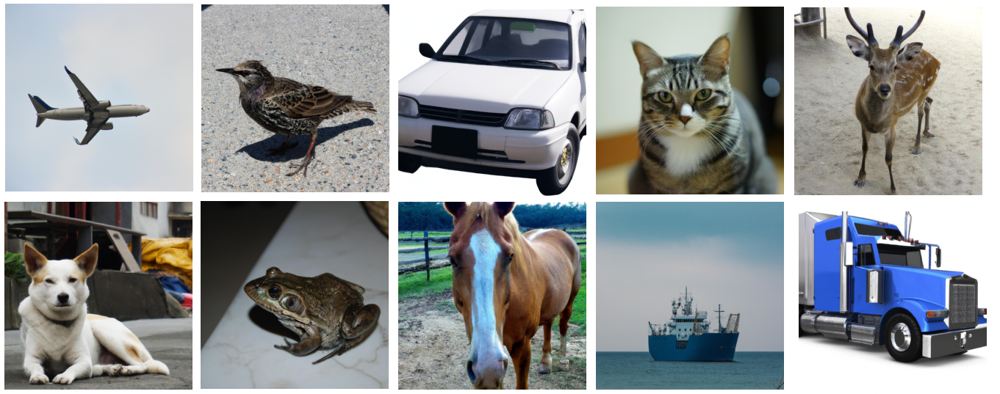
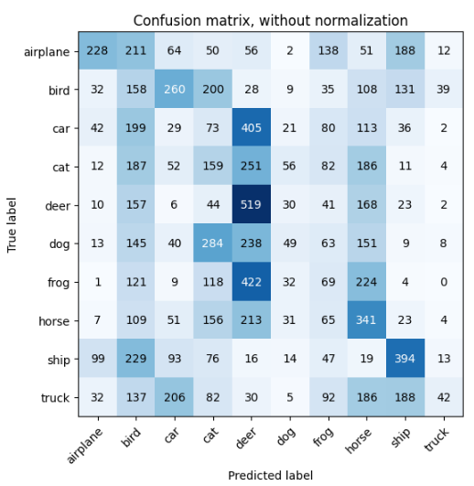
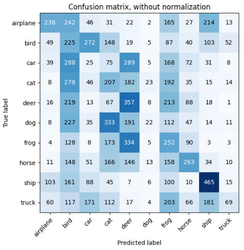

# Synthetic Image Classification

An experimental image classification project investigating whether
AI-generated images can be used as training data for a convolutional
neural network.

The project extends a previous AlexNet image classification implementation
by generating a synthetic dataset, training the model on the generated
images, and evaluating how well the resulting model generalizes to
real CIFAR-10 images.

## Project Overview

A synthetic dataset was generated using the OpenAI API across the
10 CIFAR-10 image categories.

The generated images were converted into a TensorFlow dataset and used
to train an AlexNet-based convolutional neural network.

The trained model was then evaluated using both generated images and
real CIFAR-10 images. Adam and Nadam optimizers were also compared.

## Features

- Synthetic image dataset generation using the OpenAI API
- 10 image classification categories
- 510 generated training images
- AlexNet-based convolutional neural network
- TensorFlow/Keras dataset pipeline
- Training and validation dataset split
- Image resizing and preprocessing
- Data augmentation
- Adam and Nadam optimizer comparison
- Evaluation on generated and CIFAR-10 images
- Confusion matrix analysis

## Technologies

- Python
- TensorFlow
- Keras
- OpenAI API
- Jupyter Notebook
- CIFAR-10

## Dataset

The generated dataset contains images from the same 10 categories
used by CIFAR-10:

- Airplane
- Bird
- Car
- Cat
- Deer
- Dog
- Frog
- Horse
- Ship
- Truck

The generated images were resized to 32×32 pixels to match the
input dimensions of CIFAR-10.

The dataset was divided into training and validation subsets,
with 20% of the generated images used for validation.

## Model

An AlexNet-based CNN from a previous image classification project
was adapted to work with the generated dataset.

Additional preprocessing layers were introduced for:

- Image augmentation
- RGB value rescaling
- Input normalization

The model uses convolutional, pooling, dropout, and fully connected
layers for image classification.

## Experiments

Two optimizers were evaluated:

- Adam
- Nadam

The models were tested using both generated images and real CIFAR-10
images to evaluate how well a network trained on synthetic data
generalizes to real-world examples.

## Results

The model was evaluated on CIFAR-10 images using confusion matrices.

### Adam

### Nadam

| Optimizer | CIFAR-10 Accuracy |
|-----------|------------------:|
| Adam      | 19.88% |
| Nadam     | 21.23% |

Nadam provided slightly better performance in the experiments.

For comparison, the previous AlexNet model trained directly on
CIFAR-10 achieved substantially higher accuracy, demonstrating the
importance of dataset size and training-data quality.

## Findings

The experiments showed that synthetic images can provide usable
training data, but the limited dataset size and inconsistencies in
generated images significantly affected generalization.

Some generated images contained additional or ambiguous objects,
which introduced noise into the training data.

The project demonstrated the importance of:

- Dataset quality
- Dataset size
- Data preprocessing
- Optimizer selection
- Validation on real-world data